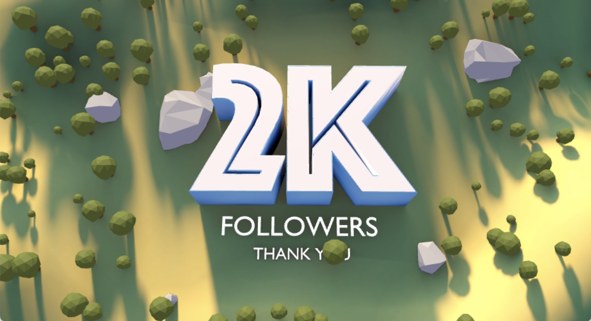
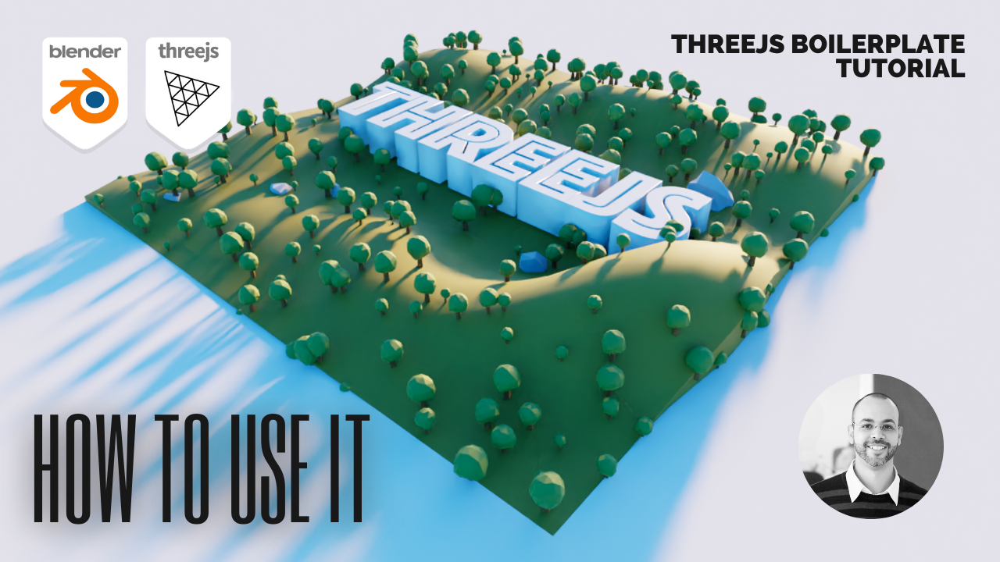
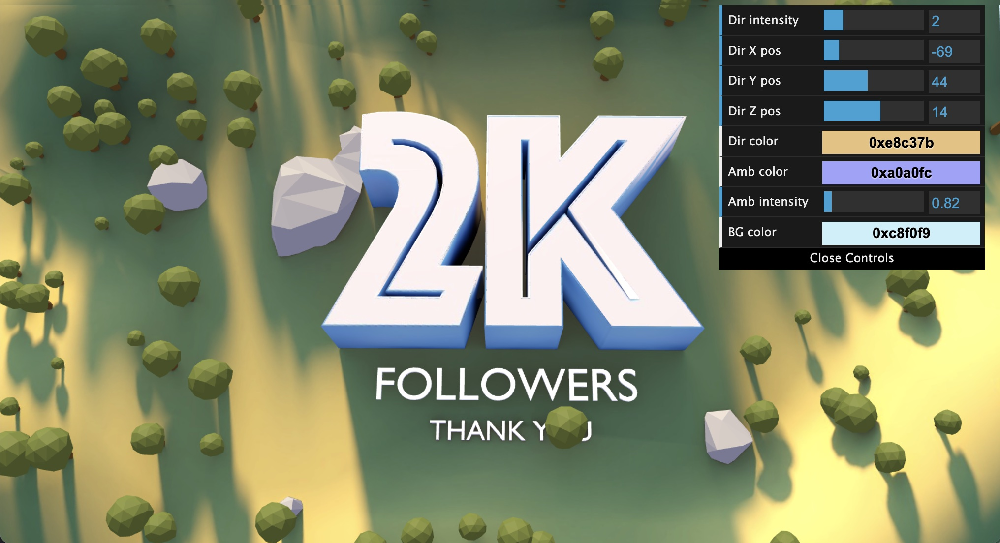

# Ektogamat ThreeJS Boilerplate
<h4>by Anderson Mancini</h4>

<p align="center">
    
</p>

# Introduction
This is a three.js starter project with only 120 lines.

But why create another threejs boilerplate when there are already so many out there?

When I started, I had a hard time finding something simple and written in VanillaJS that would allow, with just a few lines of code, to import a model and have something functional on the screen. Also, most of the examples that exist in the threejs documentation need to be in this framework for them to work just by copying and pasting the code.

So I decided to share this starter project that tries to make things a little easier. This uses a very basic setup of Node.js to make it easier to install project dependencies and also webpack to make development easier.

I think this would be very useful for web developers, who are trying to get started with threejs. In the source file, which is all documented, you can understand the basic structure of a project in threejs.

Resources: [Threejs](https://threejs.org/), [WebGL](https://github.com/KhronosGroup/WebGL), [webpack](https://webpack.js.org/) , [Babel](https://babeljs.io/ ), [ESLint](https://eslint.org/)

# Show, don't tell 
Here you can see a video on how to use this
<a href="https://www.youtube.com/embed/qM6Ih_cC6Gc" target="_blank"></a>

# Getting Started
Download and install Node.js on your computer (https://nodejs.org/en/download/).

Then, open VSCODE, drag the project folder to it. Open VSCODE terminal and install dependencies (you need to do this only in the first time)
```
npm install
```

Run this command in your terminal to open a local server at localhost:8080
```
npm run dev
```

# Debug interface

You can enable a debug interface by getting the contents of "debug.js" file and place it in the end of the main file. This will give you some interface to change things like colors and light position, which can be very useful when you change the model to something else.

# Some projects developed using this
- https://neotix.com.br/vitrine-virtual/
- https://rava-cycle-neotix.glitch.me/
- https://vitamine-se.glitch.me/
- https://neotix.com.br/promo_havaianas/
- https://realestate-neotix.vercel.app/
- https://windland-neotix.vercel.app/
- https://dna-chain.vercel.app/
- http://houses-neotix.vercel.app/
- https://fgr-implantacao.vercel.app/
- https://metaverse-event.vercel.app/


# Notes
Would be really appreciated if you are willing to give me a star here on GitHub 🎉 or buy me a coffee ☕ https://www.buymeacoffee.com/andersonmancini. The money will be used to produce more content about threejs or to buy new courses.

I plan to add more functionality to this over time, like the ability to use advanced controls, particle systems, etc. If you have any questions or somewhere I can do better, welcome to send an <a href="mailto:andersonmancini30@gmail.com">e-mail</a> to me 🙏